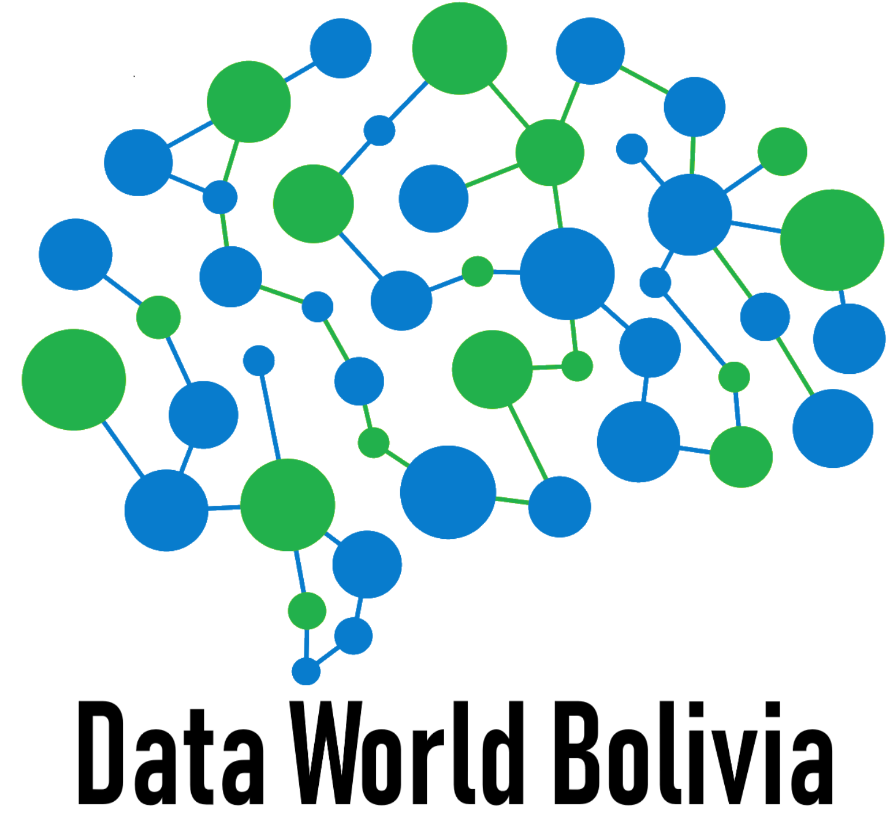

<script>
  $(document).ready(function() {
    $head = $('#header');
    $head.prepend('<div class="knitr source"></div>')
  });
</script>
---
title: "Metodología Box Jenkins para pronósticar el precio del Bitcoin"
author: "Data World Bolivia (Departamento de Investigación DWB-DI) "
date: "`r Sys.Date()`"
output: rmarkdown::html_vignette
vignette: 
  \VignetteIndexEntry{Vignette Title}
  \VignetteEngine{knitr::rmarkdown}
  \VignetteEncoding{UTF-20}
---

```{r setup, include = FALSE}
knitr::opts_chunk$set(
  collapse = TRUE,
  comment = "#>"
)
```

Los modelos de series de tiempo univariados son regresiones de una variable en función a su propio pasado, la cuestión es poder identificar los rezagos adecuados de la variable identificando momentos del pasado que explican mejor a la variable: $Y_{t} = a_{0} + a_{1}Y_{t-1}  + a_{2}Y_{t-2} + \epsilon_{t}$

## Mineria de Datos
Muchos lenguajes de programación como `R`,`Python` y programas estadísticos como `Stata` nos permiten escribir codigo para poder obtener muchas bases de datos en tiempo real de variables financieras, precios de materias primas, tipos de cambio, variables macroeconómicas. 


## Base de Datos Bitcoin 2018 

En el caso de utilizar `R` para poder minar datos del `Bitcoin` en el 2018 debes escribir el siguiente código :

    library(quantmod) 
      getSymbols("BTCUSD=X",src="yahoo",from = "2018-01-01", 
           to = Sys.Date())
           
```{r echo=F, message=FALSE, results='hide'}
library(quantmod) 
      getSymbols("BTCUSD=X",src="yahoo",from = "2018-01-01", 
           to = Sys.Date())
head(`BTCUSD=X`, 10)
datable<-`BTCUSD=X`[,-5]

```


```{r echo=F}
knitr::kable(head(datable, 10))

```


Una correcta visualización de los datos nos permite conocer todo el comportamiento de la variable. 
Este año el bitcoin sufrió una caída constante.

```{r, fig.show='hold',fig.width=14, fig.height=10}
chartSeries(na.locf(`BTCUSD=X`), theme="white",TA="addVo();addBBands();addCCI()")
```

El bitcoin tuvo una cotizacióin de casi 20.000 \$ a inicios del 2018 y cierra el año con un promedio de 3.700\$ .La revolución financiera que significa el bitcoin está en sus precios mínimo, es importante pronosticar el comportamiento de esta criptomoneda constantemente, para eso se utilizará un modelo de Series de Tiempo Univariado llamado `ARIMA` que para una correcta aplicación sigue los pasos de una metodología de 5 pasos `Metodología Box Jenkins`

- Pruebas de raíz unitarias
- Identifiación del orden AR() I() MA() con la ayuda de las funciones de Auto-Correlación y Auto-Correlación Parcial 
- Estimación de un modelo ARIMA significativo 
- Pruebas de ruido blanco en los residuos
- Pronosticar
```{r echo=F, message=FALSE, results='hide'}
library(astsa)
library(stats)
library(tseries)
library(forecast)
library(timeSeries)
bitcoin<-ts(`BTCUSD=X`$`BTCUSD=X.Close`)
```

```{r echo=F, message=FALSE,results='hide', fig.show='hold',fig.width=14, fig.height=10}
arimabitcoin<- sarima(bitcoin, 1,0,0)
```
##Pronóstico para los siguientes 30 días 
```{r echo=F, message=FALSE,results='hide', fig.show='hold',fig.width=14, fig.height=10}
mod1 <- arima(bitcoin, order = c(0,0,0), season = list( order = c( 1,1,1), period=12))
plot(forecast(mod1, h = 30), main = "pronósticos 30 días")
```

## Aprende practicando con nuestros cursos:


[Curso de Estadística Aplicada con R](https://drive.google.com/open?id=19OeeZMSIreqyoBLNg9LUZjPqHlGXQT3H)


[Curso de Pronósticos en Series Temporales](https://drive.google.com/open?id=1HQcUqaUXjkWZsrAg-4M7XOpzfoSBgnsN)


